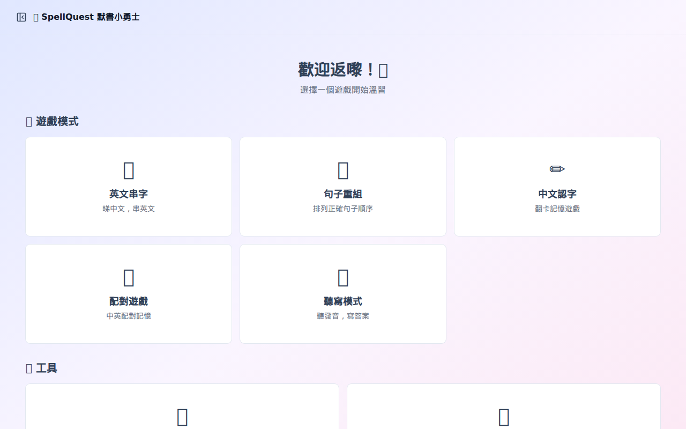
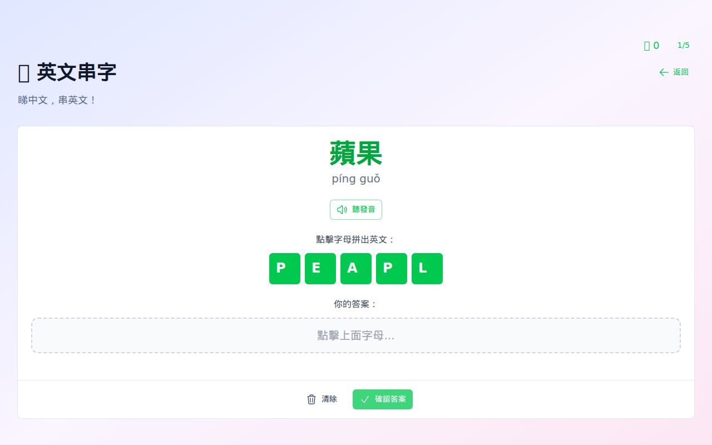
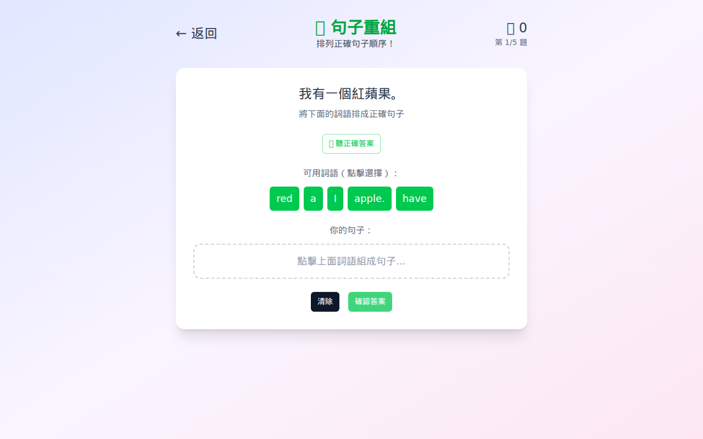
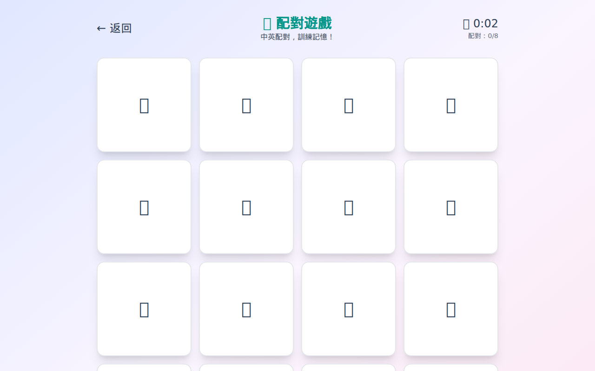
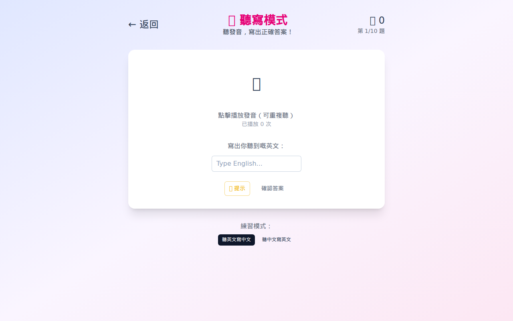
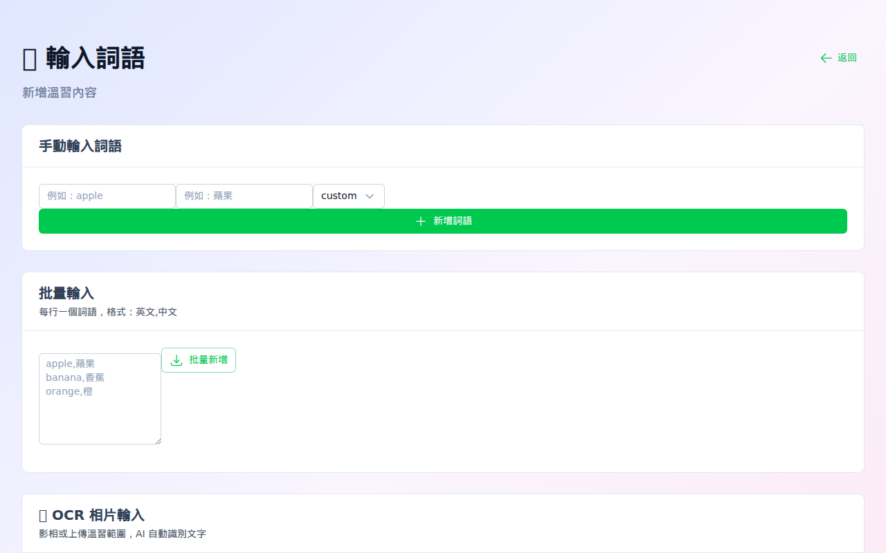
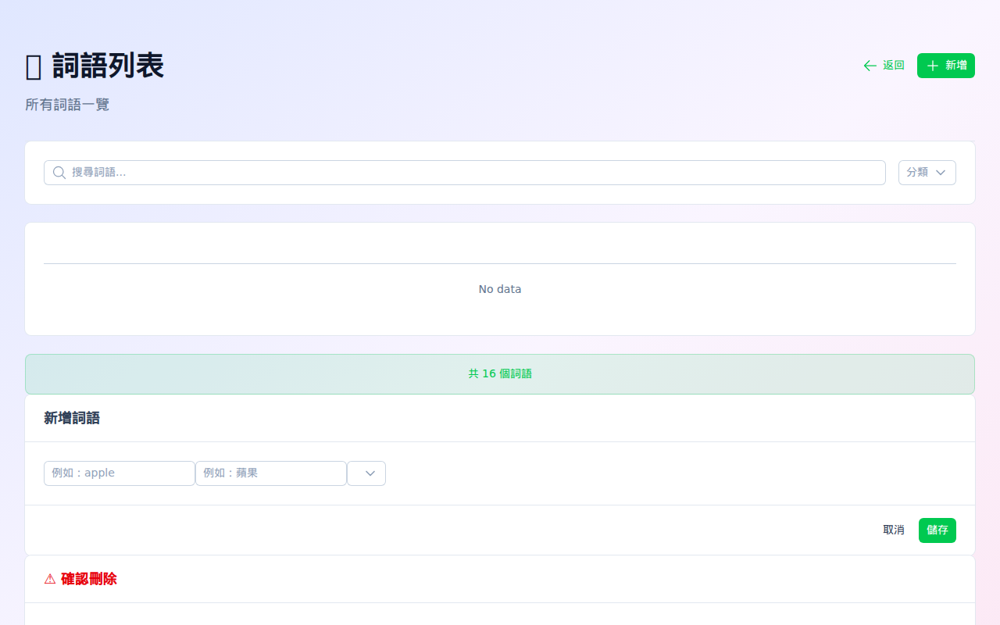

# SpellQuest 默書小勇士 🎮

> 小學生默書溫習遊戲平台 - 讓學習變得有趣！


## ✨ 功能

### 🎮 遊戲模式
| 模式 | 描述 | 狀態 |
|------|------|------|
| 🔤 英文串字 | Wordwall 風格拼字遊戲 | ✅ 完成 |
| 📝 句子重組 | 拖拽重組英文句子 | ✅ 完成 |
| ✏️ 中文認字 | Flashcard 記憶卡 | ✅ 完成 |
| 🎯 聽寫模式 | 聽發音寫答案 | ✅ 完成 |
| 🔗 配對遊戲 | 中英配對記憶 | ✅ 完成 |
| 📷 OCR 輸入 | 影相上傳溫習範圍 | 🚧 開發中 |

### 📱 其他功能
- 🔊 中英文 TTS 發音
- 📚 詞語管理（新增/批量輸入）
- 📊 學習進度追蹤
- 🏆 成就徽章系統

## 🚀 快速開始

### 前置要求

- Docker & Docker Compose
- **GitHub Copilot Token** (用於 OCR 功能)

### 取得 GitHub Token

1. 登入 GitHub
2. Settings → Developer settings → Personal access tokens
3. Generate new token (classic)
4. 勾選 `copilot` scope
5. 複製 token（格式：`ghu_xxxxx`）

### 使用 Docker Compose（推薦）

```bash
# Clone repo
git clone https://github.com/Area2-HK-Limited/spellquest.git
cd spellquest

# 設定環境變數
cp .env.example .env
# 編輯 .env，填入你的 GITHUB_TOKEN

# 一鍵啟動
docker-compose up -d

# 打開瀏覽器
open http://localhost:3000
```

### 本地開發

```bash
# Frontend
cd frontend
npm install
npm run dev

# 打開 http://localhost:3000
```

## 📸 截圖

### 🏠 主頁


### 🔤 英文串字


### 📝 句子重組


### ✏️ 中文認字 (Flashcard)


### 🔗 配對遊戲


### 🎯 聽寫模式


### 📷 輸入詞語


### 📚 詞語列表


### 📊 學習統計


## 🛠️ 技術架構

```
┌─────────────────────────────────────────┐
│                Frontend                  │
│         Nuxt 3 + NUXT UI Pro            │
│         + Web Speech API (TTS)          │
└─────────────────┬───────────────────────┘
                  │
                  ▼
┌─────────────────────────────────────────┐
│               PostgREST                  │
│           RESTful API Layer             │
└─────────────────┬───────────────────────┘
                  │
                  ▼
┌─────────────────────────────────────────┐
│              PostgreSQL                  │
│            Database Layer               │
└─────────────────────────────────────────┘
```

| Layer | Technology |
|-------|------------|
| Frontend | Nuxt 3 + NUXT UI Pro + Tailwind CSS |
| API | PostgREST |
| Database | PostgreSQL 15 |
| TTS | Web Speech API |
| OCR | **Claude Sonnet 4.5 (via GitHub Copilot API)** |
| Deploy | Docker Compose |

## 📁 項目結構

```
spellquest/
├── docker-compose.yml      # 一鍵部署
├── README.md
├── CONTRIBUTING.md         # 開發指南
├── docs/
│   └── DEVELOPMENT_PLAN.md
├── frontend/
│   ├── nuxt.config.ts
│   ├── app.vue
│   ├── pages/
│   │   ├── index.vue       # 主頁
│   │   ├── spelling.vue    # 英文串字
│   │   ├── sentence.vue    # 句子重組
│   │   ├── flashcard.vue   # 中文認字
│   │   ├── dictation.vue   # 聽寫模式
│   │   ├── matching.vue    # 配對遊戲
│   │   ├── input.vue       # 詞語輸入
│   │   ├── words.vue       # 詞語列表
│   │   └── stats.vue       # 學習進度
│   └── components/
├── backend/
│   └── sql/
│       └── init.sql        # Database schema
└── screenshots/
```

## 👥 團隊

| 成員 | 負責範圍 |
|------|----------|
| M01 Router | 遊戲邏輯、新功能、測試部署 |
| W01 頭皮 | UI/UX、動畫效果、Mobile |
| W02 面油 | Backend API、OCR、GRWTH 整合 |

## 🤝 參與開發

請參考 [CONTRIBUTING.md](CONTRIBUTING.md)

## 👨‍👩‍👧 目標用戶

專為小學生設計，特別適合：
- 📖 中文默書練習
- 🔤 英文串字練習
- 📝 英文句子重組

## 📄 License

MIT

---

Made with ❤️ by AI Team for 沛晨
